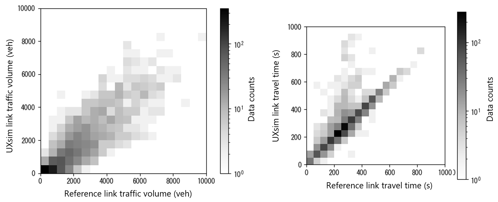

# Summary

Car traffic plays an essential role in today's cities.
However, it faces severe issues such as time loss due to congestion, accidents, and environmental pollution.
Proper traffic planning and control are necessary to solve these issues.
Traffic flow simulators are powerful engineering tools for such purposes.
By using traffic flow simulators, one can test and optimize traffic plans or control strategies before implementing them in the real world.
Furthermore, traffic flow simulators can be used for pure academic or scientific experiments to investigate the complex physics of traffic flow.

*UXsim* is a pure Python package for traffic flow simulation that is suitable for simulating a wide range of scenarios, from simple toy networks to large-scale (e.g., city-wide) traffic phenomena.
It computes dynamic traffic flow in arbitrary road networks with arbitrary travel demands.
For example, it can simulate how traffic jams evolve in a city, how people reroute to avoid them, and how traffic management schemes can improve the situation.

# Statement of need

In general, traffic flow simulators are divided into two major categories: microscopic and macroscopic.
The former focuses on detailed individual vehicle behaviors, whereas the latter focuses on the collective behavior of large-scale (e.g., city-scale) traffic.
Mesoscopic traffic flow simulators, which is sometimes categorized into macroscopic ones, are a mixture of the two; while they describe individual vehicle behaviors to some extent, their primary intention is to simulate the collective behavior of large-scale traffic.
Mesoscopic simulators are particularly useful for modeling large-scale traffic management and operations, such as congestion pricing, ridesharing, and automated vehicle fleet management, which are increasingly prominent these days.
Several microscopic traffic flow simulators are published as open source software, such as SUMO [@sumo].
However, to the author's knowledge, the availability of mesoscopic and macroscopic simulators is limited.

*UXsim* is a mesoscopic (or macroscopic depending on the technical terminology) traffic flow simulator.
It is particularly designed to be simple, lightweight, and easy to use, thanks to the simplicity of mesoscopic traffic flow models.
Therefore, it can be readily used by users to simulate small-scale to large-scale traffic flow.
It also includes built-in analysis and visualization capabilities for simulation results.

A unique feature of *UXsim* is that it is written in pure Python.
Except for common components in *NumPy* and *SciPy*, no pre-compiled binary is used in *UXsim*.
Therefore, it can be easily and deeply integrated with other Python-based frameworks, such as *PyTorch* for deep reinforcement learning-based traffic control.
Users with Python knowledge can customize the code of *UXsim* to make it suitable for their own purposes.
This makes *UXsim* a powerful tool for state-of-the-art research.
Nevertheless, the computation speed is not too slow, leveraging mesoscopic traffic flow simulation techniques and the *NumPy* and *SciPy* packages.

*UXsim* can be used by any user who has basic Python skills and an interest in traffic.
It can be used for various purposes, such as university education and as an experimental environment for researchers in fields like civil engineering, urban planning, operations research, computer science, and others.
It has already been used in a number of scientific publications such as Large Language Model-based system control [@microsofttrace], traffic signal optimization in a network [@iizuka], and strategic impact evaluation of automated vehicles on a regional scale [@terHoeven2024master].

# Related works

Several open source traffic simulators have been published and are widely used by the community.
See @Lovelace for a more comprehensive survey of open source software for transport planning, including traffic simulators.

*SUMO* [@sumo] is perhaps the most popular traffic simulator.
It is a microscopic traffic simulator with a Python interface *TraCI* and an optional mesoscopic simulation mode.
There are several other open source microscopic traffic simulators, for example, *MovSim* [@movsim], *A/B Street* [@abstreet], and *CityFlow* [@cityflow], to name a few.
However, the primary objectives of microscopic simulators are significantly different from those of macroscopic or mesoscopic ones.
They aim to describe detailed driving behaviors of individual vehicles to simulate microscopic interactions, such as lane-changing and conflicts at intersections.
While these microscopic phenomena are very important for some purposes, they may not be essential when evaluating city-wide traffic management.
Additionally, microscopic simulators generally require extensive information, such as detailed road geometry and a large number of model parameters.

*MATSim* [@matsim] is a more strategic-level transportation simulator that aims to simulate activity-travel behavior.
In fact, a certain mode of *MATSim* uses models that are equivalent to those in *UXsim*.
However, *MATSim* focuses more on holistic mobility, including people's travel decisions and mode choices in multi-modal transportation systems.
*UXsim* focuses on traffic flow simulation, making it simpler and easier to use and integrate with other packages.

*dyntapy* [@dyntapy] is a macroscopic traffic simulator in Python.
While it shares several features with *UXsim*, there are some distinct differences.
*UXsim* is based on a discretized (agent-based) modeling framework, in contrast to the continuous modeling framework of *dyntapy*.
The advantage of the former is more flexible modeling of traveler behavior and vehicle routing, while the disadvantage is higher computational cost and numerical discrepancies with the original mathematical traffic flow theory.
Related to this, *UXsim* allows simulation to be run incrementally, and users can flexibly intervene by coding.
This provides an excellent opportunity to implement traffic control and management schemes.
*DTALite* [@Zhou2014dtalite; @dtalite] is a mesoscopic traffic simulator written in C++.
Its features are similar to those of *dyntapy*.

# Models

*UXsim* implements the following models, which are based on rigorous, well-validated, and commonly utilized theories by both researchers and practitioners:

- Newell's simplified car-following model [@newell] and its mesoscopic extension X-model [@laval] for traffic behavior on each link, such as acceleration and deceleration of vehicles.
- Incremental Node Model [@flotterod_macro] and its mesoscopic version [@flotterod_meso] for traffic behavior at each intersection, such as merging and waiting.
- Dynamic User Optimum-type route choice model [@kuwahara] for drivers' route choices that prefer the shortest path based on travel time information.

In addition, the models implemented in *UXsim* are slightly extended from the original ones to represent more realistic traffic behavior as follows:

- The mesoscopic car-following model is extended to a single-pipe, multi-lane model to accommodate higher traffic capacity depending on the number of lanes on each link.
- Explicit consideration of traffic signals and bottlenecks at nodes.
- Stochasticity and delay are incorporated into the route choice model to stabilize traffic patterns.

Detailed explanations of the mathematics and algorithms behind *UXsim* are described in @seo_book and @seo_arxiv.

# Examples

Various examples and demos are available as Python scripts and Jupyter notebooks in the GitHub repository of *UXsim*.
This section introduces three examples to illustrate some of the key features of *UXsim*: simplicity, controllability, and scalability.
They are also available at the GitHub repository in executable notebooks.

## Simple example

### Code

The following code executes *UXsim* in a simple setting.

```python
from uxsim import *

# Define the main simulation
# Units are standardized to seconds (s) and meters (m)
W = World(
    name="",    # Scenario name
    deltan=5,   # Simulation aggregation unit delta n
    tmax=1200,  # Total simulation time (s)
    print_mode=1, save_mode=1, show_mode=0,    # Various options
    random_seed=0    # Set the random seed
)

# Define the scenario
## Create nodes
W.addNode(name="orig1", x=0, y=0)  #xy coords are for visualization 
W.addNode("orig2", 0, 2)
W.addNode("merge", 1, 1)
W.addNode("dest", 2, 1)
## Create links between nodes
W.addLink(name="link1", start_node="orig1", end_node="merge",
          length=1000, free_flow_speed=20, number_of_lanes=1)
W.addLink("link2", "orig2", "merge", 
          length=1000, free_flow_speed=20, number_of_lanes=1)
W.addLink("link3", "merge", "dest", 
          length=1000, free_flow_speed=20, number_of_lanes=1)
## Create OD traffic demand between nodes
W.adddemand(orig="orig1", dest="dest", t_start=0, t_end=1000, flow=0.45)
W.adddemand("orig2", "dest", 400, 1000, flow=0.6)

# Run the simulation to the end
W.exec_simulation()

# Print summary of simulation result
W.analyzer.print_simple_stats()

# Visualize snapshots of network traffic state for several timesteps
W.analyzer.network(100, detailed=1, network_font_size=12)
W.analyzer.network(600, detailed=1, network_font_size=12)
W.analyzer.network(800, detailed=1, network_font_size=12)
```

The meaning of each function would be intuitive for Python users.
It simulates traffic flow in a Y-shaped network with four nodes (intersections) and three links (roads).

### Results

It outputs the following text to stdout.
```
simulation setting:
 scenario name:
 simulation duration:    1200 s
 number of vehicles:     810 veh
 total road length:      3000 m
 time discret. width:    5 s
 platoon size:           5 veh
 number of timesteps:    240
 number of platoons:     162
 number of links:        3
 number of nodes:        4
 setup time:             0.00 s
simulating...
      time| # of vehicles| ave speed| computation time
       0 s|        0 vehs|   0.0 m/s|     0.00 s
     600 s|      130 vehs|  13.7 m/s|     0.03 s
    1195 s|       75 vehs|  12.3 m/s|     0.06 s
 simulation finished
results:
 average speed:  11.6 m/s
 number of completed trips:      735 / 810
 average travel time of trips:   162.6 s
 average delay of trips:         62.6 s
 delay ratio:                    0.385
```
The simulation of 810 vehicles for 20 minutes duration was finished in 0.06 seconds a standard office PC.

It also outputs the figures shown in \autoref{simple_example_res} that visualize the network traffic states.
In the figures, vehicles travel from left to right.
A light-colored segment is with free-flowing traffic, and dark-colored one is with traffic jam.
Therefore, it means traffic jam occurred at the upper link "link2" due to a merge at the "merge" node.


## Traffic signal control by deep reinforcement learning 

In this example, we optimize traffic signal setting (which direction should have green light under what conditions) using *UXsim* and deep reinforcement learning (more specifically, Deep-Q Network [@dqn]) implemented by *PyTorch*.
A small road network with 4 signalized intersections with given traffic demand is simulated.
\autoref{DQNepisodes} shows the learning progress.
\autoref{figDQN} shows typical network traffic states in some episodes.
We can confirm that it converged to a very efficient traffic situation where vehicles are not delayed significantly by the traffic signals.

{ width=40% }


## Metropolitan-scale simulation

In this example, trips of nearly 1 million vehicles during a rush hour in Chicago metropolitan area are simulated, just in 40 seconds.
We use a dataset called "Chicago-Sketch" [@transpnetwork] that has been widely utilized for transportation research.
\autoref{chicago} shows some of the vehicle trajectories at a certain time step in the simulation.

{ width=70% }

The "Chicago-Sketch" dataset contains reference traffic data such as link traffic volume and travel time.
The comparison of *UXsim* results and the reference values are shown in \autoref{chicago_compare}.
Because these values were computed by different methods, we cannot draw precise conclusions about the accuracy of *UXsim*, but at least we can say that the results are well correlated and *UXsim* outputs plausible results.

{ width=80% }

# Acknowledgements

The author would like to thank contributions from [Ewout ter Hoeven](https://github.com/EwoutH) and various feedbacks from they, the reviewers, and other users.


# References
